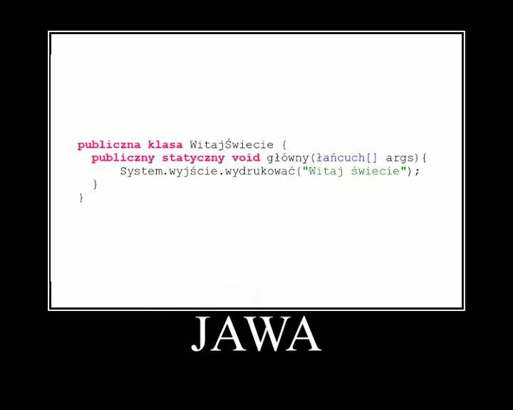

<p align="center">
    
    <p align="center">
    (Unknown author)
    </p>
</p>

# Jawa

Jawa jest obiektowy język programowania.

The Jawa programming language compiler was inspired by the meme above (author unknown).

## Status

The compiler is incomplete and it contains a few ad-hoc solutions. However, the example program can be compiled along
with the library.

## Code Example

<pre lang="jawa">
<span class="pl-k">publiczna klasa</span> <span class="pl-v">WitajŚwiecie</span> {
    
    <span class="pl-k">publiczny statyczny void</span> <span class="pl-v">głowny</span>(<span class="pl-v">Łańcuch</span>[] <span class="pl-v">args</span>) {
        <span class="pl-v">System</span>.<span class="pl-v">wyjście</span>.<span class="pl-v">wydrukovać</span>(<span class="pl-c1">"Witaj świecie"</span>);
    }
    
}
</pre>

## Compiling the Sources

```
$ mkdir build
$ cd build
$ cmake -DBISON_ROOT=<bison_install_dir> -DFLEX_ROOT=<flex_install_dir> ..
```

Jawa compiler:

```
$ make jawac
```

Jawa standard library:

```
$ make jawa_stdbib
```

## Project Structure

`jasm` is a library for low-level library for JVM byte code manipulation.

`jawa` is a Jawa compiler implemented using `jasm`.

`stdbib` contains sources of Jawa standard library (standardowa biblioteka).

`editor` contains plugins for supported code editors.

## Compiling Jawa Programs

```
$ build/jawa/jawac --ścieżkaklasy .:stdbib test/WitajŚwiecie.jawa
```

Make sure you have copiled the standard library.

## Running the Compiled Programs

You need to specify standard library path and classpath:

```
$ java -Djava.library.path=build/stdbib -classpath stdbib:. WitajŚwiecie
```

## References

- [Jasmin - JVM assembler](http://jasmin.sourceforge.net/)
- [Java Grammar](https://docs.oracle.com/javase/specs/jls/se7/html/jls-2.html)
- [Java Class File Format](https://docs.oracle.com/javase/specs/jvms/se7/html/jvms-4.html#jvms-4.1)
- [JVM Instruction Set](https://docs.oracle.com/javase/specs/jvms/se7/html/jvms-6.html)
- [Java SableCC Grammar](https://sablecc.org/java1.7/) (Not suitable for Bison)
- [Java LALR(1) Grammar](https://www.cs.cornell.edu/andru/javaspec/19.doc.html) (Old version of Java)
